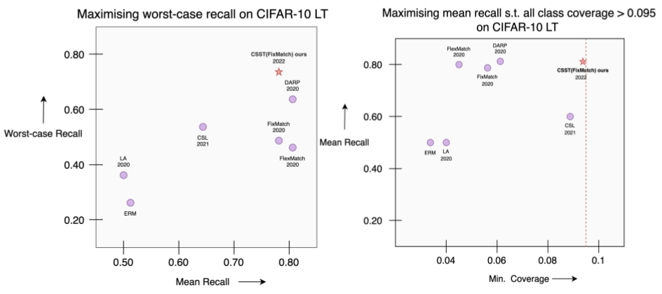

# Code Repositiory for CSST
**Cost Sensitive Self-Training for Optimising Non-decomposable Measures** 

**Authors**: Harsh Rangwani*, Shrinivas Ramasubramanian*, Sho Takemori*, Kato Takashi, Yuhei Umeda, Venkatesh Babu Radhakrishnan  

**NeurIPS 2022**  

[Paper](https://openreview.net/pdf?id=bGo0A4bJBc)

### Introduction 
Self-training with semi-supervised learning algorithms allows highly accurate deep neural networks to be learned using only a fraction of labeled data. However, most self-training work focuses on improving accuracy, while practical machine learning systems have non-decomposable goals, such as maximizing recall across classes. We introduce the Cost-Sensitive Self-Training (CSST) framework, which generalizes self-training methods for optimizing non-decomposable metrics. Our framework can better optimize desired metrics using unlabeled data, under similar data distribution assumptions made for the analysis of self-training. Using CSST, we obtain practical self-training methods for optimizing different non-decomposable metrics in both vision and NLP tasks. Our results show that CSST outperforms the state-of-the-art in most cases across datasets and objectives.

## Usage

### Installation

1. Create and activate a conda environment
```bash
conda create -n CSST
conda activate CSST
```
2. Clone and install the requisite libraries
```bash
git clone https://github.com/val-iisc/CostSensitiveSelfTraining
cd CostSensitiveSelfTraining
pip install -r requirements.txt
```
3. We recommend installation of [W&B](https://wandb.ai/) (weights and biases for detailed logging of performance metrics 

### Training

### Evaluation

## Results
We provide a summary of results for CIFAR-10 LT for the two objectives below, in comparison to the state-of-the-art:




## Citation
In case you find our work useful, please consider citing us as:
```
@inproceedings{
rangwani2022costsensitive,
title={Cost-Sensitive Self-Training for Optimizing Non-Decomposable Metrics},
author={Harsh Rangwani and Shrinivas Ramasubramanian and Sho Takemori and Kato Takashi and Yuhei Umeda and Venkatesh Babu Radhakrishnan},
booktitle={Advances in Neural Information Processing Systems},
editor={Alice H. Oh and Alekh Agarwal and Danielle Belgrave and Kyunghyun Cho},
year={2022},
url={https://openreview.net/forum?id=bGo0A4bJBc}
}
```
## Contact
Please feel free to file an isssue or send us an email, in case you have any comments or suggestions.
